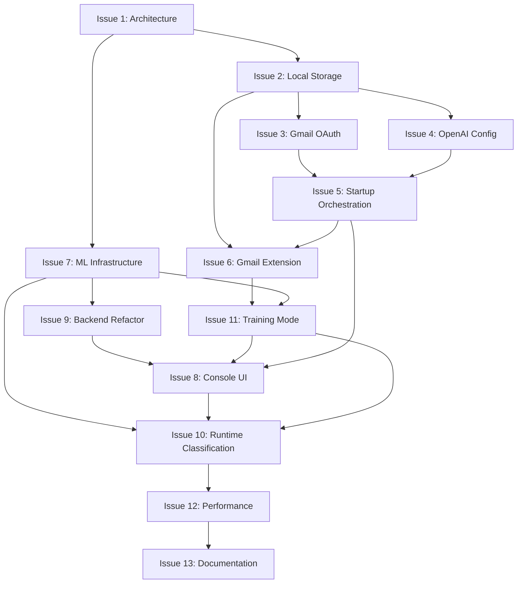

# Architecture Shift: From LLM to Local ML Model

**Issue Reference**: #53  
**Created**: March 14, 2026  
**Status**: Planning

## Overview

This document outlines the architectural shift from using external LLM services (OpenAI GPT-4o-mini) to training and running a small, local machine learning model for email classification. The project will transition from Avalonia UI to a console-based interface while maintaining backend/frontend separation for future UI flexibility.

**Key Project Goals**:

- **Open Source**: Build a community-driven tool for personal email management
- **Personal ML Models**: Each user trains their own model based on their unique email patterns and preferences
- **Privacy First**: 100% local processing - emails and training data never leave the user's machine
- **Console-First Design**: Lightweight, scriptable, automation-friendly interface with rich colors for clarity
- **MCP Compatible**: Designed to integrate with Model Context Protocol (MCP) servers for AI assistant integration
- **User-Specific Learning**: No generic "one size fits all" model - each user's classifier is unique to their habits

## Core Architecture Changes

### Current Architecture

- **UI**: Avalonia 11 cross-platform desktop application
- **Classification**: OpenAI GPT-4o-mini API calls
- **Storage**: SQLite with encrypted credentials
- **Email Source**: Gmail API (live emails only)

### Target Architecture

- **UI**: Console-based TUI (Terminal User Interface) using modern .NET libraries
- **Classification**: Locally-trained ML model (ML.NET or similar) - supports action classification (keep/archive/delete/spam) AND label/folder classification
- **Storage**: SQLite + local email archive with feature vectors
- **Email Source**: Gmail API (live + archived + deleted + spam + all labels for training)
- **Modes**: Runtime mode (classify emails + apply labels) + Training mode (build/update model)

## Technology Stack Recommendations

### Console UI Framework

Research modern equivalents to Unix `dialog`/`whiptail`:

- **Terminal.Gui** (gui-cs/Terminal.Gui) - Full TUI framework, cross-platform
- **Spectre.Console** - Modern, rich console output with interactive prompts, **excellent color support**
- **ConsoleGUI** - Lightweight alternative

**Recommendation**: Start with **Spectre.Console** for simplicity, migrate to Terminal.Gui if more complex UI needed.

**Color Strategy**:

- **Spectre.Console** provides rich color and formatting support
- Use semantic colors throughout:
  - **Green** (✓) - Success states, ready providers, successful operations
  - **Red** (✗) - Errors, failed connections, critical issues
  - **Yellow** (⚠) - Warnings, optional configurations, medium confidence
  - **Blue** (ℹ) - Information, status updates, help text
  - **Cyan** - Highlights, email subjects, important data
  - **Magenta** - Model metrics, performance stats
- **CRITICAL**: Use bright/bold colors for connector errors to ensure visibility
- Support NO_COLOR environment variable for accessibility

### Machine Learning Framework

- **ML.NET** - Native .NET, supports binary/multi-class/multi-label classification, good for local training
- **TorchSharp** - If more complex models needed
- **ONNX Runtime** - For model deployment if trained elsewhere

**Recommendation**: **ML.NET** for .NET-native experience and good multi-class/multi-label classification support. We'll need:

- **Action Classification Model**: Multi-class (keep/archive/delete/spam)
- **Label Classification Model**: Multi-label (can predict multiple Gmail labels per email)

### Feature Extraction Libraries

- **MimeKit** - Already used for email parsing, good for header/body extraction
- **Natural** - NLP library for .NET
- **Custom feature engineering** - Domain-specific signals (sender patterns, subject keywords, etc.)

## High-Level GitHub Issues

### Issue 1: Architecture & Design Document

**Title**: Define ML-based architecture and feature extraction strategy

**Description**:
Create comprehensive architecture document defining:

- Separation of concerns between UI, classification engine, and data layer
- Feature extraction pipeline (what signals to extract from emails)
- Model training workflow (initial training, incremental updates)
- Data storage schema for email features and full email backup
- Model versioning and rollback strategy
- Performance requirements and constraints

**Deliverables**:

- `/docs/ML_ARCHITECTURE.md` - Complete architecture specification
- `/docs/FEATURE_ENGINEERING.md` - Feature extraction specification
- `/docs/MODEL_TRAINING_PIPELINE.md` - Training workflow documentation

**Dependencies**: None

---

### Issue 2: Local Email Storage System

**Title**: Implement configurable local email archive with 50GB default limit

**Description**:
Design and implement local storage system for:

- **Feature vectors**: Extracted signals from each email (sender, subject patterns, timestamps, etc.)
- **Full email storage**: Complete email data when possible (for future feature regeneration)
- **Metadata**: Classification decisions, user corrections, training labels
- **Storage limits**: Configurable cap (default 50GB), automatic pruning of oldest data
- **Retention policy**: Keep features even after full email deleted, prioritize user-corrected emails

**Technical Details**:

- Extend existing SQLite schema or create separate ML database
- Schema for email features table
- Schema for full email BLOB storage
- Implement storage monitoring and automatic cleanup
- Configuration via `appsettings.json` for storage limits

**Deliverables**:

- New migrations for email archive schema
- `EmailArchiveService` implementation
- Storage monitoring and cleanup logic
- Unit tests for storage management

**Dependencies**: Issue 1 (architecture defines schema)

---

### Issue 3: Console-Based Gmail OAuth Configuration

**Title**: Implement console OAuth flow for Gmail authentication replacing Avalonia UI

**Description**:
Adapt the existing Gmail OAuth flow for console-based interaction:

- Implement OAuth 2.0 device flow or browser-based flow triggered from console
- Check Gmail OAuth token status on application startup
- Guide user through authentication if token missing/expired
- Securely store refresh tokens using existing OS keychain infrastructure
- Support token refresh and expiration handling
- Provide clear console prompts and status messages

**Console OAuth Flow** with colors:

1. **On Startup**: Check for existing valid Gmail OAuth token
2. **If Missing**: Display message: "[yellow]Gmail authentication required[/]"
3. **OAuth Initiation**:
   - Option A (Browser-based): "[blue]Opening browser for Gmail authentication...[/]" → Open default browser with OAuth URL
   - Option B (Device flow): "[blue]Visit:[/] [cyan]https://google.com/device[/] [blue]and enter code:[/] [cyan bold]ABCD-EFGH[/]"
4. **Wait for Callback**: Poll for authorization completion with timeout
   - Progress: "[dim]Waiting for authorization...[/]" with spinner
5. **Token Storage**: Save refresh token to OS keychain using `SecureStorageManager`
6. **Success**: "[green]✓ Gmail authenticated successfully[/]"
7. **Error Handling**: "[bold red]✗ Gmail OAuth failed:[/] [red]{error_details}[/]"
   - Common errors: Network timeout, user denied, invalid credentials
   - All OAuth errors displayed in bold red with detailed error message

**Startup Configuration Check Flow** with colors:

```
[bold]TrashMail Panda v2.0 - ML Edition[/]
==================================

[blue]Checking configuration...[/]
  [green]✓[/] Database initialized
  [green]✓[/] Storage provider ready
  [yellow]?[/] Gmail OAuth not configured
  [blue]ℹ[/] OpenAI API key not set (optional)

[yellow]Gmail authentication required to continue.[/]
Would you like to authenticate now? (Y/n):
```

**Technical Details**:

- Reuse existing `SecureStorageManager` for token storage
- Adapt `GmailEmailProvider` OAuth logic for console
- Use system browser for OAuth callback (HTTP listener on localhost)
- Implement timeout handling (2-minute max for OAuth flow)
- Clear error messages for common OAuth failures

**Deliverables**:

- `ConsoleOAuthHandler` for Gmail authentication
- Startup configuration checker (console version)
- OAuth flow with browser launch or device code
- Token validation and refresh logic
- Integration with existing `SecureStorageManager`
- Error handling and user guidance
- Unit tests for OAuth flow

**Dependencies**: Issue 2 (storage system for tokens)

---

### Issue 4: Console-Based OpenAI API Configuration (Optional)

**Title**: Implement console-based OpenAI API key configuration for optional LLM features

**Description**:
While the primary classification uses local ML models, OpenAI may still be used for:

- Initial feature extraction experimentation
- Advanced email analysis features
- Generating training data suggestions
- Natural language rule generation

Implement console-based API key management:

- Prompt for OpenAI API key on first run (optional)
- Securely store API key using OS keychain
- Validate API key on startup (non-blocking check)
- Allow key updates/removal via configuration menu
- Support skipping OpenAI configuration (mark as optional)

**Console Configuration Flow** with colors:

```
[bold]OpenAI API Configuration (Optional)[/]
====================================

[blue]OpenAI integration enables advanced features like:[/]
  [dim]•[/] Enhanced email analysis
  [dim]•[/] Natural language rule suggestions
  [dim]•[/] Training data quality checks

Do you want to configure OpenAI? (y/N): n
  [blue]ℹ[/] Skipping OpenAI configuration. You can add it later via Settings.

OR if user selects yes:

Do you want to configure OpenAI? (y/N): y
Enter your OpenAI API key: [dim]sk-...[/]
  [blue]→ Validating API key...[/]
  [green]✓ API key validated successfully[/]
  [green]✓ Saved to secure keychain[/]

OR if validation fails:

  [bold red]✗ API key validation failed:[/] [red]Invalid API key or network error[/]
  Would you like to try again? (Y/n):
```

**Settings Menu** with colors (accessible via main menu):

```
[bold cyan]Settings[/]
========
1. Gmail Account ([green]configured:[/] [cyan]user@gmail.com[/])
2. OpenAI API Key ([green]configured:[/] [dim]sk-...xyz[/])
3. Storage Limit ([blue]current:[/] [cyan]50GB[/])
4. Model Settings
5. Advanced Options
Q. Back to Main Menu

Select option:
```

**Technical Details**:

- Reuse existing `SecureStorageManager` for API key storage
- Implement API key validation (test API call to OpenAI)
- Non-blocking validation (don't fail startup if OpenAI unavailable)
- Configuration stored separately from Gmail tokens
- Allow easy key rotation/updates
- Use Spectre.Console colors for all status messages
- **Validation errors in bold red** with clear error messages

**Deliverables**:

- `ConsoleConfigurationManager` for API key management
- OpenAI API key validation logic with colored output
- Settings menu implementation with color-coded status
- Secure storage integration
- Optional configuration flow (can skip)
- Unit tests for configuration management

**Dependencies**: Issue 2 (storage system), Issue 3 (configuration pattern established)

---

### Issue 5: Console Startup Orchestration & Health Checks

**Title**: Implement console-based startup orchestration with provider health checks

**Description**:
Create startup system for console app that mirrors Avalonia's provider health check system:

- Check all required providers on startup (Gmail, Storage, optional OpenAI)
- Display clear status for each provider
- Guide user through missing configuration
- Graceful degradation for optional providers
- Exit to configuration if required providers unavailable

**Startup Sequence**:

1. **Display Banner**: App name, version, mode
2. **Initialize Services**: DI container, logging, database
3. **Health Checks**: Run provider health checks in parallel
4. **Status Display**: Show results with clear indicators
5. **Configuration Flow**: If issues detected, guide user to fix
6. **Mode Selection**: Once configured, prompt for runtime/training mode

**Startup UI Example**:

```
╔═══════════════════════════════════════════╗
║   TrashMail Panda v2.0 - ML Edition       ║
║   Intelligent Email Classification         ║
╚═══════════════════════════════════════════╝

Initializing application...

Provider Status:
  ✓ Storage Provider     [Ready]
  ✓ Gmail Provider       [Authenticated: user@gmail.com]
  ⚠ OpenAI Provider     [Not configured - optional]
  ✓ ML Model (Action)    [v1.2.3 - Accuracy: 92.3%]
  ✓ ML Model (Label)     [v1.2.1 - F1: 87.5%]

System Ready!

Select Mode:
  1. Runtime Mode (Classify emails)
  2. Training Mode (Train/update models)
  3. Settings
  Q. Quit

Your choice:
```

**Configuration Required Flow**:

```
Provider Status:
  ✓ Storage Provider     [Ready]
  ✗ Gmail Provider       [Not configured]
  ⚠ OpenAI Provider     [Not configured - optional]
  ✗ ML Models           [No trained models found]

⚠ Configuration required before use

Required:
  • Gmail authentication
  • Train initial models (at least 100 emails)

Would you like to configure now? (Y/n): Y

==> Starting configuration wizard...
```

**Color Scheme for Status Display**:

- ✓ (Green): Provider ready/healthy
- ✗ (Bold Red): Provider failed/error - **MUST be highly visible**
- ⚠ (Yellow): Warning/optional configuration
- ℹ (Blue): Information/status messages
- Connection errors: **Bold Red with error details in red**
- Example: `[bold red]✗ Gmail Provider[/] [red]Connection failed: Network timeout[/]`

**Technical Details**:

- Reuse existing provider health check interfaces
- Implement console-specific status display (use Spectre.Console for formatting and colors)
- Parallel health checks (same as Avalonia)
- Individual provider timeouts
- Configuration wizard for first-time setup
- Mode selection after successful initialization
- Use Spectre.Console markup for all colored output
- Ensure connector errors are displayed in bold red with full error details

**Deliverables**:

- `ConsoleStartupOrchestrator` implementation
- Provider health check integration
- Status display with Spectre.Console colors
- Configuration wizard for first-time setup
- Mode selection menu
- Graceful error handling
- Unit tests for startup orchestration

**Dependencies**: Issue 2 (storage), Issue 3 (Gmail config), Issue 4 (OpenAI config)

---

### Issue 6: Gmail Provider Extension for Training Data

**Title**: Extend Gmail provider to fetch archived, deleted, spam emails AND all labels as training data

**Description**:
Enhance `GmailEmailProvider` to:

- Fetch emails from Archive, Trash, and Spam folders
- Retrieve read/unread status for classification signals
- Handle bulk email fetching for initial training
- Respect Gmail API quotas and implement batch processing
- Track which emails have been processed for training

**Classification Signal Rules**:

- **Spam folder**: Strong signal for "auto-delete"
- **Trash folder**: Signal for "auto-delete"
- **Archive + Unread**: Signal for "auto-archive without reading"
- **Archive + Read**: Exclude from training (user wanted to read)
- **Inbox + Read**: Exclude from training (user engaged with email)
- **Inbox + Unread**: Unclear signal, use with caution

**Deliverables**:

- New methods in `GmailEmailProvider` for folder-specific queries
- Batch processing with rate limiting
- Training data labeling logic based on folder + read status
- Integration tests for new Gmail queries

**Dependencies**: Issue 2 (needs storage system)

---

### Issue 7: ML.NET Model Training Infrastructure

**Title**: Implement ML.NET training pipeline for email classification (actions + labels)

**Description**:
Build the machine learning training infrastructure with **two parallel models**:

1. **Action Classification Model** (Multi-class): Keep, Archive, Delete, Spam
2. **Label Classification Model** (Multi-label): Predict which Gmail labels to apply

**Implementation Details**:

- Research and select ML.NET algorithms:
  - Action model: Multi-class classification (one prediction)
  - Label model: Multi-label classification (multiple predictions with confidence)
- Implement shared feature extraction pipeline
- Implement separate training pipelines for each model type
- Implement training mode with progress tracking
- Implement model evaluation and metrics (accuracy, precision, recall, F1)
- Implement model versioning and storage (separate versions for each model)
- Support for incremental training (update models with new data)

**Feature Engineering Considerations**:

- Sender domain patterns
- Sender email frequency (how often this sender emails user)
- Subject line keywords/patterns
- Email body content signals (length, links, images)
- Time patterns (when emails arrive)
- Thread participation (replies vs broadcasts)
- Attachment presence/types
- Email age when classified
- Historical label patterns (if sender previously got labeled)

**Label Model Specific Considerations**:

- Handle class imbalance (some labels rare, others common)
- Support minimum confidence thresholds per label
- Handle new/unseen labels (transfer learning approach)
- Predict top-k labels (e.g., top 3 most likely labels)

**Deliverables**:

- `IMLModelProvider` interface (supports both model types)
- `MLNetActionClassifier` implementation
- `MLNetLabelClassifier` implementation
- Shared feature extraction pipeline
- Training pipeline for both models
- Model evaluation and metrics reporting
- Model storage and versioning system (tracks both models)
- Unit tests for feature extraction and both classifiers

**Dependencies**: Issue 1 (defines features), Issue 2 (provides data source)

---

### Issue 8: Console UI with Spectre.Console

**Title**: Implement console-based TUI replacing Avalonia UI

**Description**:
Create modern console interface focusing on one-email-at-a-time workflow:

- **Runtime Mode UI**: Present one email, show classification, allow user override
- **Training Mode UI**: Show training progress, metrics, model evaluation
- **Configuration UI**: Manage settings, storage limits, Gmail authentication
- **Minimal, focused design**: Show only essential information, avoid clutter

**UI Workflow (Runtime Mode)** with colors:

1. Display: "[cyan]Email 1/237:[/] [bold][Subject][/] from [dim][Sender][/]"
2. Show AI classification:
   - "[green]Action:[/] Archive ([yellow]85% confidence[/])"
   - "[green]Labels:[/] newsletters ([green]92%[/]), promotions ([yellow]78%[/])"
3. Prompt: "(A)ccept / (K)eep / (D)elete / (L)abel / (E)dit labels / (V)iew full / (S)kip / (Q)uit"
4. Execute action and move to next email
5. Error handling: "[bold red]✗ Error applying action:[/] [red]Connection timeout[/]"

**UI Workflow (Training Mode)** with colors:

1. "[blue]Fetching training data from Gmail...[/]"
2. "[blue]Importing label taxonomy: [cyan]23 labels[/] found[/]"
3. "[blue]Processing [cyan]1,247[/] emails...[/]"
4. "[blue]Training action classification model...[/] (Progress bar in green/yellow/red)"
5. "[blue]Training label classification model...[/] (Progress bar)"
6. "[green]Action Model[/] - Accuracy: [magenta]92.3%[/] | Precision: [magenta]89.1%[/] | Recall: [magenta]94.2%[/]"
7. "[green]Label Model[/] - Hamming Loss: [magenta]0.12[/] | F1 (micro): [magenta]0.87[/]"
8. "[green]Top performing labels:[/] newsletters ([magenta]95%[/]), receipts ([magenta]93%[/]), work ([magenta]89%[/])"
9. "Save these models? (Y/N)"

**Color Guidelines**:

- Use Spectre.Console markup for all colored output
- Errors: **Bold red** for maximum visibility
- Success: Green
- Metrics/Stats: Magenta
- Highlights: Cyan
- Information: Blue
- Warnings: Yellow
- **Provider/Connector Errors**: Always bold red with detailed error message in red

**Deliverables**:

- `TrashMailPanda.Console` project
- Spectre.Console integration with full color support
- Runtime mode implementation with colored UI
- Training mode implementation with colored progress
- Configuration/settings UI with color coding
- Help system and command reference
- Color scheme constants/configuration

**Dependencies**: Issue 7 (needs model for runtime mode)

---

### Issue 9: Backend Refactoring for UI Abstraction

**Title**: Refactor backend to support multiple UI frontends (Console & Avalonia)

**Description**:
Separate business logic from UI to support both console and future UI implementations:

- Create `IClassificationService` abstraction
- Create `IApplicationOrchestrator` for workflow management
- Move classification logic out of ViewModels into services
- Create UI-agnostic event system for progress/status updates
- Deprecate Avalonia UI (don't delete, just disable in build)

**Architecture Pattern**:

```
Console UI ──┐
             ├──> IApplicationOrchestrator ──> IClassificationService ──> IMLModelProvider
Avalonia UI ─┘                               └──> IEmailProvider
                                             └──> IStorageProvider
```

**Deliverables**:

- `IClassificationService` interface and implementation
- `IApplicationOrchestrator` interface and implementation
- Refactored service layer
- Deprecation notices in Avalonia project
- Build configuration to exclude Avalonia by default

**Dependencies**: Issue 7 (defines classification service contract)

---

### Issue 10: Runtime Classification with User Feedback Loop

**Title**: Implement model-based classification (actions + labels) with user correction feedback

**Description**:
Build the runtime classification system:

- Load trained model on startup
- Classify emails one at a time
- Present classification with confidence scores
- Allow user to override classification
- Store user corrections as high-value training data
- Support batch processing with user review
- Handle edge cases (low confidence, new senders, etc.)

**User Feedback Loop**:

- User corrections weighted more heavily in training
- Periodic retraining suggestions when enough corrections accumulate
- Track model drift and suggest retraining

**Deliverables**:

- `RuntimeClassificationService` implementation
- User feedback storage and tracking
- Confidence threshold handling
- Batch processing with review workflow
- Integration tests for classification pipeline

**Dependencies**: Issue 7 (model training), Issue 8 (console UI), Issue 9 (service abstraction)

---

### Issue 11: Training Mode Implementation

**Title**: Implement interactive training mode with progress tracking (dual models)

**Description**:
Create comprehensive training mode:

- Scan Gmail for training data (archived, deleted, spam)
- Scan local email archive for existing data
- Extract features from all training emails
- Train model with progress visualization
- Evaluate model performance
- Save model with versioning
- Support incremental training from new data

**Training Workflow**:

1. **Data Collection**: Scan Gmail + local archive
2. **Feature Extraction**: Process emails into feature vectors
3. **Training**: ML.NET model training with progress
4. **Evaluation**: Test against validation set
5. **Review**: Show metrics and sample predictions
6. **Save**: Version and store model

**Deliverables**:

- `TrainingModeService` implementation
- Progress tracking and reporting
- Model evaluation and metrics display
- Incremental training support
- Training data management
- Unit and integration tests

**Dependencies**: Issue 6 (Gmail data), Issue 7 (ML infrastructure), Issue 8 (console UI)

---

### Issue 12: Performance Optimization & Production Readiness

**Title**: Optimize performance and prepare for production use

**Description**:
Ensure system performs well with large datasets:

- Benchmark feature extraction performance
- Optimize model inference speed (target: <100ms per email)
- Implement caching for repeated feature calculations
- Optimize database queries for large archives
- Memory management for batch processing
- Error handling and recovery
- Logging and diagnostics

**Performance Targets**:

- Feature extraction: <50ms per email
- Model inference: <100ms per email
- Training on 10K emails: <5 minutes
- UI responsiveness: No blocking operations

**Deliverables**:

- Performance benchmarks
- Optimization implementations
- Comprehensive error handling
- Production logging configuration
- Performance documentation

**Dependencies**: Issues 7, 8, 10, 11 (all core systems implemented)

---

### Issue 13: Documentation & Migration Guide

**Title**: Create comprehensive open-source documentation emphasizing personal ML model training

**Description**:
Comprehensive documentation for the new system with **strong emphasis on the open-source nature and MCP (Model Context Protocol) intent**:

**Key Documentation Themes**:

- **Open Source Philosophy**: TrashMail Panda is an open-source tool for building personal email classification models
- **Personal Model Building**: Users train their own models based on their personal email patterns and preferences
- **Privacy First**: All processing happens locally, no data sent to external services except user's own Gmail account
- **Console-First Design**: Lightweight, scriptable, automation-friendly interface
- **MCP Integration**: Can be used as an MCP component for AI assistants
- **No One-Size-Fits-All**: Each user's model is unique to their email habits

**Documentation Sections**:

- Architecture overview and design decisions
- **Why Console UI**: Explanation of console-first approach for automation and simplicity
- **Building Your Personal Model**: Step-by-step guide to training a model that reflects your email preferences
- Getting started guide for new users
- Training mode usage guide (detailed)
- Runtime mode usage guide
- Feature engineering documentation
- Model management and versioning
- **MCP Integration Guide**: How to use with MCP servers and AI assistants
- **Privacy & Security**: How data is stored and processed locally
- Troubleshooting guide
- Migration guide from LLM version
- **Contributing Guide**: How to contribute to the open-source project

**README.md Updates** (critical for open-source visibility):

```markdown
# TrashMail Panda v2.0 - Personal Email ML Classifier

[](LICENSE)
[](https://dotnet.microsoft.com/)
[](https://dotnet.microsoft.com/apps/machinelearning-ai/ml-dotnet)

**Build your own personal email classification model that learns YOUR email habits.**

TrashMail Panda is an open-source console application that trains a local machine learning model to classify your emails based on YOUR preferences. No cloud services, no generic models—just your personal email assistant.

## Why TrashMail Panda?

- 🏠 **100% Local**: All training and classification happens on your machine
- 🎓 **Personal Learning**: Train a model based on YOUR email patterns
- 🎯 **Your Rules**: The model learns from your archive/delete/label decisions
- 🖥️ **Console First**: Lightweight, automation-friendly, MCP-compatible
- 🔒 **Privacy**: Your emails never leave your machine
- 🚀 **Fast**: Classify emails in <150ms, train on 10K emails in minutes
- 🏷️ **Smart Labels**: Automatically applies Gmail labels based on your patterns

## How It Works

1. **Train**: Scan your Gmail history (inbox, archive, trash, spam, labels)
2. **Learn**: ML model learns what YOU keep, delete, archive, and how YOU label
3. **Classify**: Model predicts actions and labels for new emails
4. **Improve**: Correct predictions and retrain for better accuracy

## MCP Integration

TrashMail Panda is designed to work with Model Context Protocol (MCP) servers, allowing AI assistants to help manage your email using your personalized model.
```

**Deliverables**:

- Updated `README.md` with open-source emphasis and MCP intent
- `docs/GETTING_STARTED_ML.md` - First-time user guide
- `docs/TRAINING_GUIDE.md` - How to build your personal model
- `docs/RUNTIME_GUIDE.md` - Using your trained model
- `docs/MODEL_MANAGEMENT.md` - Model versioning and updates
- `docs/MCP_INTEGRATION.md` - **NEW**: MCP/AI assistant integration guide
- `docs/PRIVACY_AND_SECURITY.md` - **NEW**: How data is handled locally
- `docs/MIGRATION_FROM_LLM.md` - Migration guide
- `CONTRIBUTING.md` - **NEW**: Open-source contribution guidelines
- Updated `CLAUDE.md` for AI assistants
- Screenshots/demos of console UI with colors

**Dependencies**: All other issues (full system documentation)

---

## Implementation Order



**Suggested Implementation Phases**:

1. **Phase 1 (Foundation)**: Issues 1, 2, 7
2. **Phase 2 (Configuration & Auth)**: Issues 3, 4, 5
3. **Phase 3 (Data Pipeline)**: Issues 6, 9
4. **Phase 4 (Training)**: Issue 11
5. **Phase 5 (UI & Runtime)**: Issues 8, 10
6. **Phase 6 (Polish)**: Issues 12, 13

## Storage Schema Considerations

### Email Archive Schema (SQLite)

```sql
-- Archived emails with full content
CREATE TABLE archived_emails (
    id INTEGER PRIMARY KEY AUTOINCREMENT,
    gmail_id TEXT UNIQUE NOT NULL,
    subject TEXT,
    sender TEXT,
    received_date INTEGER,
    folder TEXT, -- inbox/archive/trash/spam
    read_status BOOLEAN,
    full_email_blob BLOB, -- Full MIME content
    storage_date INTEGER,
    UNIQUE(gmail_id)
);

-- Extracted features for ML
CREATE TABLE email_features (
    id INTEGER PRIMARY KEY AUTOINCREMENT,
    email_id INTEGER REFERENCES archived_emails(id),
    feature_version INTEGER, -- Allow feature schema evolution
    sender_domain TEXT,
    subject_keywords TEXT, -- JSON array
    email_length INTEGER,
    has_attachments BOOLEAN,
    has_links BOOLEAN,
    hour_of_day INTEGER,
    day_of_week INTEGER,
    thread_size INTEGER,
    -- Additional features as JSON for flexibility
    additional_features TEXT, -- JSON object
    extracted_date INTEGER,
    UNIQUE(email_id, feature_version)
);

-- Training labels for ACTION classification and user corrections
CREATE TABLE training_actions (
    id INTEGER PRIMARY KEY AUTOINCREMENT,
    email_id INTEGER REFERENCES archived_emails(id),
    action TEXT, -- keep/archive/delete/spam
    source TEXT, -- gmail_folder/user_correction/model_prediction
    confidence REAL,
    created_date INTEGER,
    model_version TEXT
);

-- Gmail labels taxonomy
CREATE TABLE gmail_labels (
    id INTEGER PRIMARY KEY AUTOINCREMENT,
    gmail_label_id TEXT UNIQUE NOT NULL,
    name TEXT NOT NULL,
    type TEXT, -- system/user
    color TEXT,
    message_list_visibility TEXT,
    label_list_visibility TEXT,
    created_date INTEGER,
    last_updated INTEGER
);

-- Association between emails and their Gmail labels
CREATE TABLE email_labels (
    id INTEGER PRIMARY KEY AUTOINCREMENT,
    email_id INTEGER REFERENCES archived_emails(id),
    label_id INTEGER REFERENCES gmail_labels(id),
    applied_date INTEGER,
    source TEXT, -- gmail/user_correction/model_prediction
    confidence REAL, -- NULL for gmail-applied labels
    model_version TEXT,
    UNIQUE(email_id, label_id, source)
);

-- Model versions and metadata (separate for action and label models)
CREATE TABLE model_versions (
    id INTEGER PRIMARY KEY AUTOINCREMENT,
    version TEXT UNIQUE NOT NULL,
    model_type TEXT NOT NULL, -- 'action' or 'label'
    created_date INTEGER,
    training_size INTEGER,
    accuracy REAL,
    precision_score REAL,
    recall_score REAL,
    f1_score REAL,
    -- Label-specific metrics
    hamming_loss REAL,
    micro_f1 REAL,
    macro_f1 REAL,
    model_blob BLOB, -- Serialized ML.NET model
    feature_version INTEGER,
    is_active BOOLEAN DEFAULT FALSE,
    UNIQUE(version, model_type)
);

-- Per-label performance metrics (for label classification model)
CREATE TABLE label_model_metrics (
    id INTEGER PRIMARY KEY AUTOINCREMENT,
    model_version_id INTEGER REFERENCES model_versions(id),
    label_id INTEGER REFERENCES gmail_labels(id),
   - Same features for both models, or specialized features per model?

2. **Model Architecture**:
   - **Action Model**: Multi-class with confidence scores (implemented)
   - **Label Model**: Multi-label classification (one email can have multiple labels)
   - Should we use separate models or one unified model?
   - Recommendation: Separate models for flexibility and performance tuning

3. **Incremental Training**: How often should models be retrained?
   - Suggestion: User-triggered + automatic when 100+ corrections accumulated
   - Consider separate retraining triggers for each model

4. **Cold Start Problem**: How to handle initial state with no training data?
   - Suggestion: Initial training mode scans Gmail history
   - Minimum requirements: 100 emails for action model, 10 examples per label for label model
   - Handle labels with insufficient data gracefully

5. **Confidence Thresholds**: What confidence level requires user confirmation?
   - Action model: <80% confidence → require user review
   - Action Model Performance**: >85% accuracy on held-out test set
2. **Label Model Performance**: >80% F1 (micro), <0.15 Hamming Loss
3. **Per-Label Performance**: >70% F1 for labels with >50 training examples
4. **Speed**:
   - Action classification: <50ms per email
   - Label classification: <100ms per email
   - Combined: <150ms total inference time
5. **Storage Efficiency**: <50GB for typical user (10K+ emails + labels)
6. **User Efficiency**:
   - Reduce inbox triage time by >50%
   - Auto-apply labels correctly >80% of the time (measured by user acceptance rate)
7. **Training Time**:
   - Action model: <3 minutes for 10K email training set
   - Label model: <5 minutes for 10K emails (depends on # of unique labels)
8. **Label Coverage**: Successfully predict at least 1 correct label for >75% of emails
   - May need configuration option to enable/disable

7. **Label Hierarchy**: How to handle nested/hierarchical labels in Gmail?
   - Should parent labels influence child label predictions?
   - How to handle Gmail's label nesting (e.g., "Work/Projects/ProjectA")?

8. **New Label Detection**: How to handle when user creates new labels after training?
   - Retrain immediately? Wait for threshold of examples?
   - Transfer learning approach to bootstrap new labels?

9. **Label Imbalance**: Common labels vs rare labels?
   - Use class weighting in training?
   - Set minimum support thresholds per label?

10. **Multi-Label Prediction Strategy**: How many labels to predict per email?
    - Top-k approach (always predict top 3-5)?
    - Threshold approach (all labels above confidence threshold)?
    - Hybrid approach?
1. **Feature Engineering**: What features are most predictive for email classification?
   - Domain patterns, subject keywords, sender frequency, time patterns?

2. **Model Architecture**: Binary classification (keep/delete) or multi-class (keep/archive/delete/spam)?
   - Recommendation: Multi-class with confidence scores

3. **Incremental Training**: How often should model be retrained?
   - Suggestion: User-triggered + automatic when 100+ corrections accumulated

4. **Cold Start Problem**: How to handle initial state with no training data?
   - Suggestion: Initial training mode scans Gmail history, minimum 100 emails required

5. **Confidence Thresholds**: What confidence level requires user confirmation?
   - Suggestion: <80% confidence → require user review

6. **Archive Read/Unread Logic**: Should we use archive+unread as training signal?
   - Requires validation with real user data
   - May need configuration option to enable/disable

## Success Metrics

1. **Model Performance**: >85% accuracy on held-out test set
2. **Speed**: <100ms inference time per email
3. **Storage Efficiency**: <50GB for typical user (10K+ emails)
4. **User Efficiency**: Reduce inbox triage time by >50%
5. **Training Time**: <5 minutes for 10K email training set

## Risks & Mitigations

| Risk                       | Mitigation                                 |
| -------------------------- | ------------------------------------------ |
| Insufficient training data | Require minimum 100 emails before training |
| Model overfitting          | Implement cross-validation, regularization |
| Storage limits exceeded    | Automatic pruning, configurable limits     |
| Gmail API quota limits     | Batch processing with rate limiting        |
| Poor initial model         | Allow easy retraining, user feedback loop  |
| User workflow disruption   | Maintain clear one-email-at-a-time focus   |

## Future Enhancements (Out of Scope)

- Multi-account support (multiple Gmail accounts)
- Email provider abstraction (IMAP, Outlook, etc.)
- Cloud model sync across devices
- Mobile app integration
- Advanced NLP features (sentiment, entity extraction)
- A/B testing different models
- Resurrection of Avalonia UI with new backend
- Hierarchical label classification (respect label nesting in Gmail)
- Cross-label learning (transfer learning between similar labels)
- Label recommendation (suggest new labels user might want to create)
- Smart label merging (detect duplicate/similar labels)
- Temporal label patterns (labels that change meaning over time)

---

**Next Steps**: Review this document, prioritize issues, and begin implementation with Issue #1 (Architecture & Design).
```
